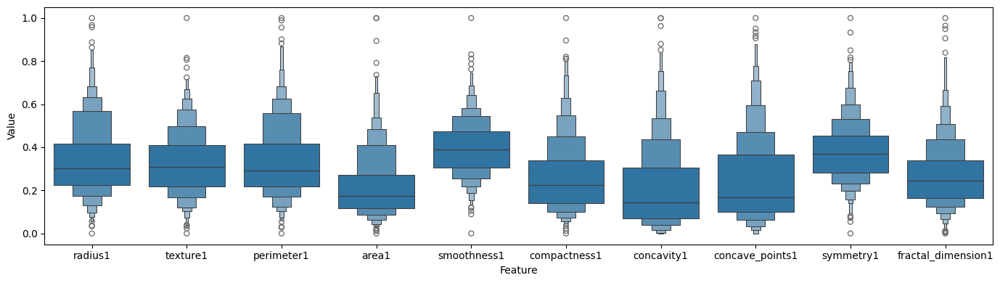
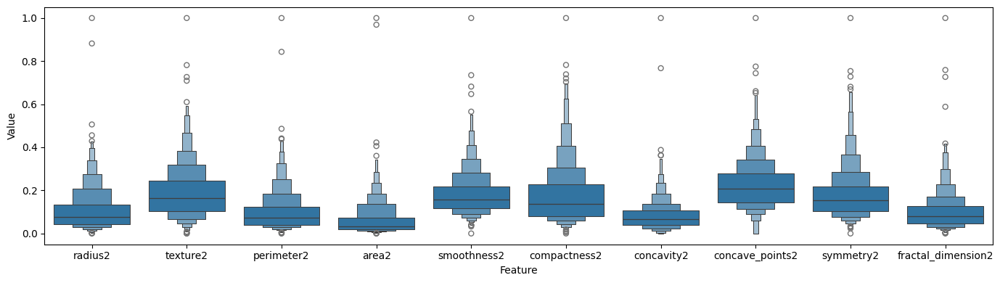
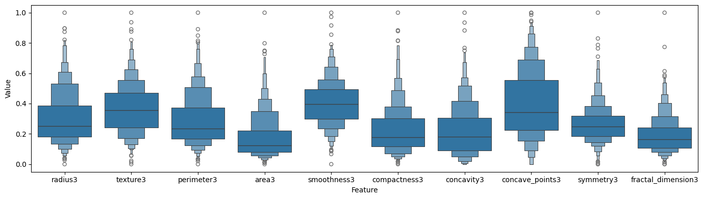
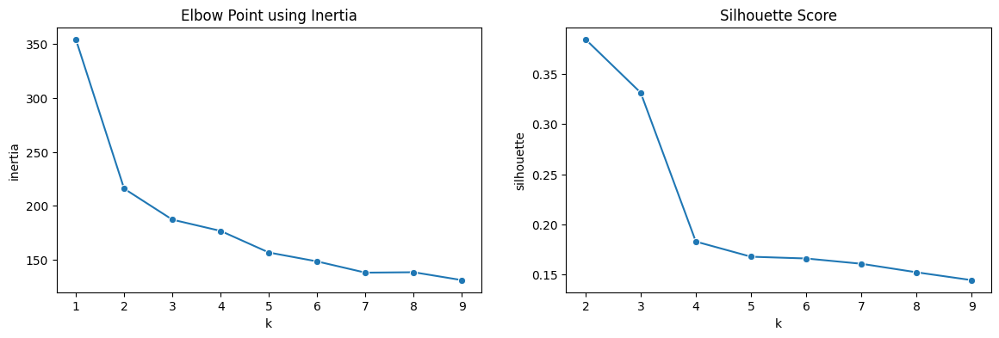
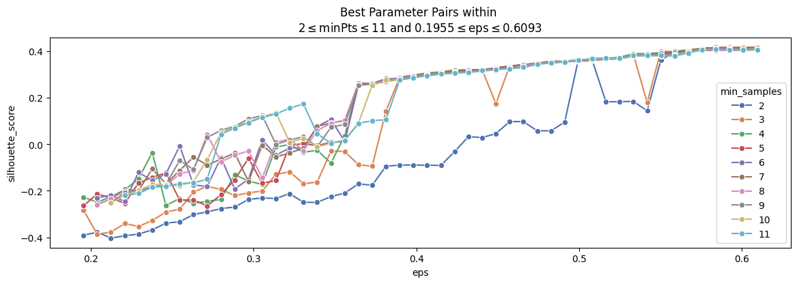
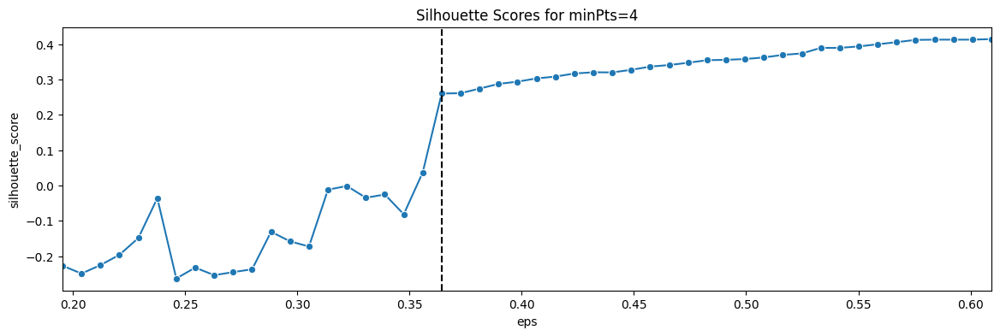
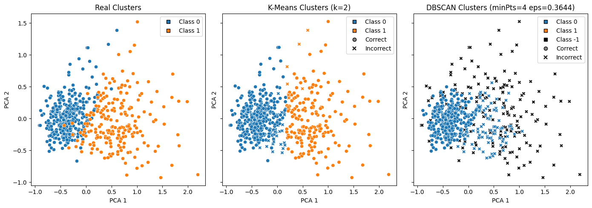

# Clustering Application with the Wisconsin Breast Cancer Dataset

## 1. Project Environment

    Python implementation: CPython
    Python version       : 3.13.7
    IPython version      : 9.6.0
    
    sklearn   : 1.7.2
    pandas    : 2.3.3
    numpy     : 2.3.4
    matplotlib: 3.10.7
    seaborn   : 0.13.2

## 2. Distribution of Normalized Features

    

## 3. Determining the Number of Clusters

* The elbow point can be selected as `k=2`, since the change in inertia becomes less significant after that point.
* While determining the number of clusters, higher silhouette score is desired. So, `k=2` is once again the best choice.
* Therefore, we can safely assume that the number of clusters is 2.

## 4. Clustering and Evaluation

### 4.1. K-Means

* `k=2` was found as the number of clusters in the previous section, so we use it here as the parameter <b>n_clusters=2</b>.
* Using Adjusted Rand Index (ARI) as the evaluation metric (which ranges between 0 and 1) gives a decent result.
    + K-Means ARI Score: 0.730175

### 4.2. DBSCAN

* First, I have used the range `2 <= minPts <= 11` to find the optimal eps ranges using 10th and 95th percentile distances of Nearest Neighbor pairs.
* When evaluated with the Silhouette Score metric, the scores for `minPts=[2,3]` seems ill-behaved even after the potential knee-point. Therefore, I have decided to use `minPts=4` going forward.
  

    

    
* Evaluating the DBSCAN labels against the ground truth using ARI metric yields a significantly worse score compared to the K-Means algorithm.
    + DBSCAN ARI Score: 0.2115

## 5. Visualisation on 2D Space

* To visualise the clusters on 2D, I have used PCA to get the two best components that represent the 30-dimensional space.

